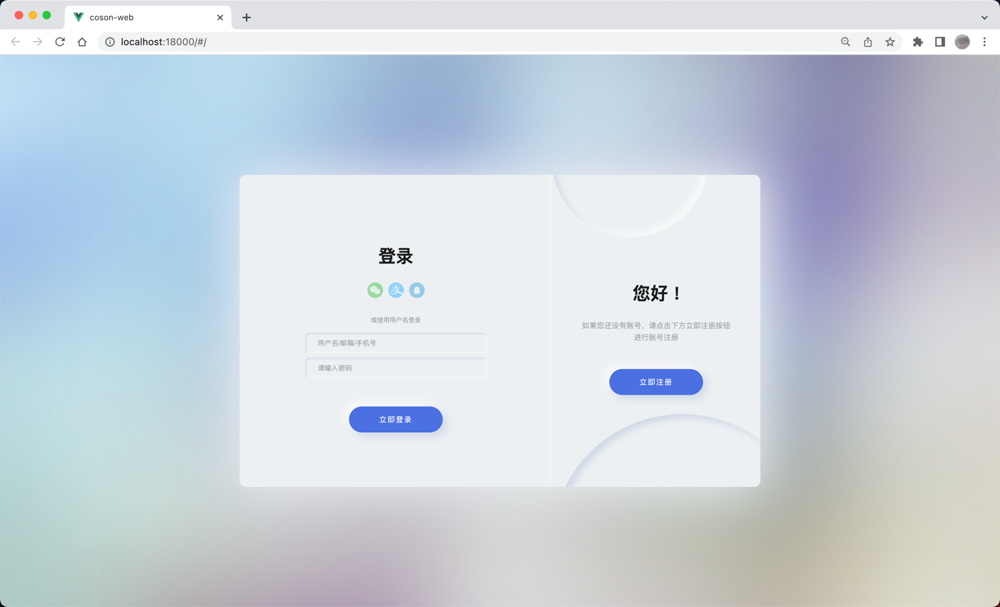
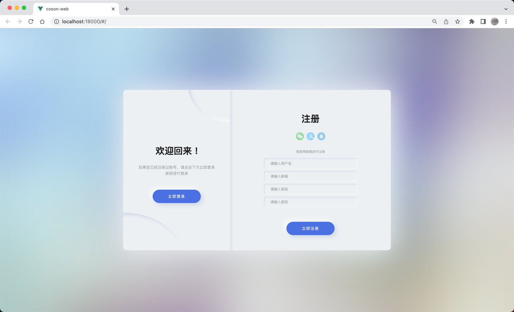
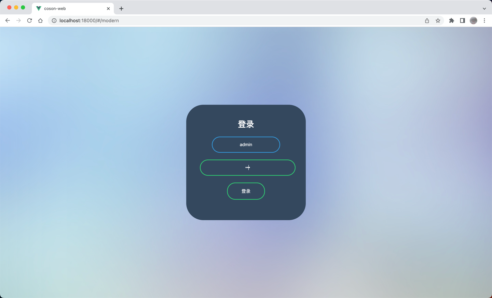
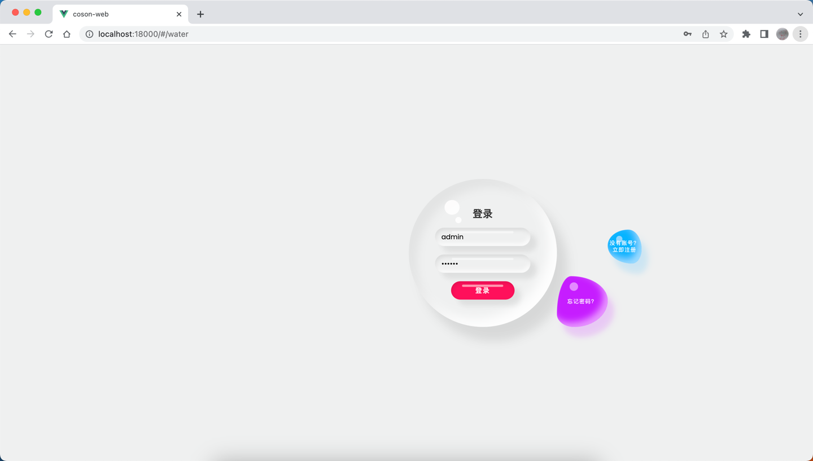
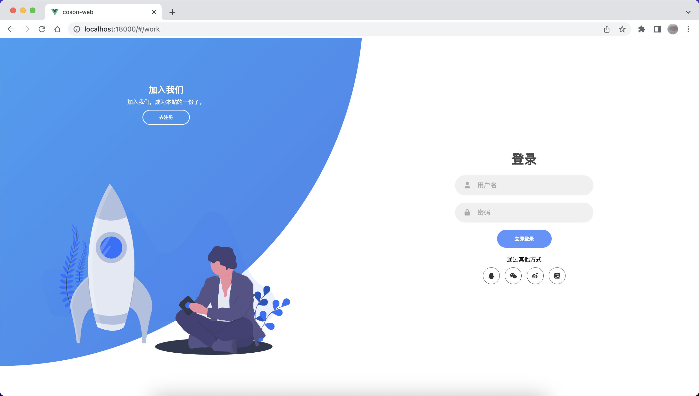
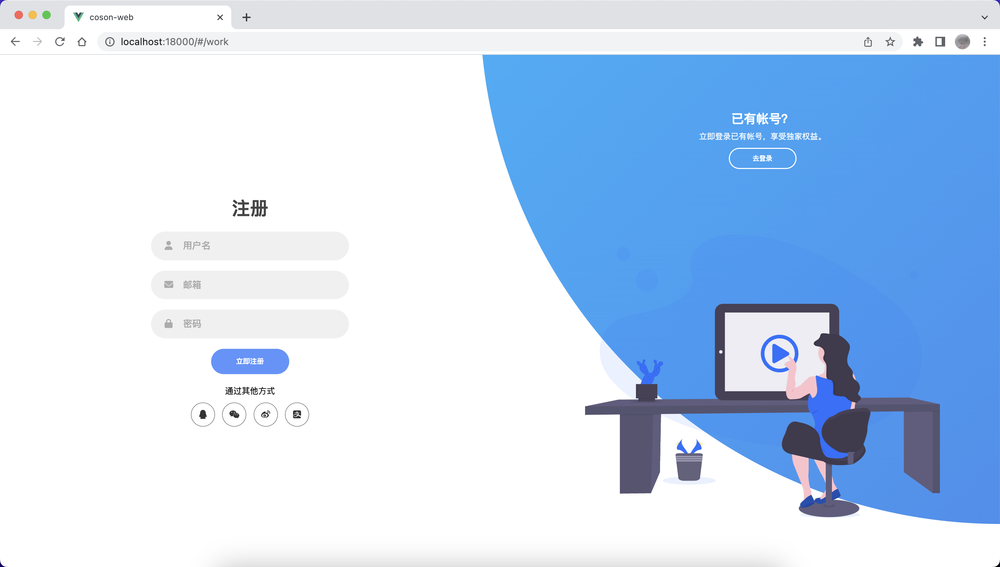

<h1 align="center"> Coson-Vue-Login </h1>

本项目根据网上各位大佬分享的登录页面模板（当然，也有大佬分享的其他vue登录页面的实现），集中整理成vue实现，请各位自取。由于本人只是一个只会CRUD的后端选手，前端技术不熟，有不对或不合理的地方请直接反馈。


## 登录页面一

参考[网上模板](https://codepen.io/ricardoolivaalonso/full/YzyaRPN)，vue文件路径：\src\views\login\LoginSwitch.vue，效果图：



## 登录页面二

参考[网上模板](https://codepen.io/Chewbaccaa/project/full/DxErdn)，vue文件路径：\src\views\login\LoginModern.vue，效果图：



## 登录页面三

参考[国外大神](https://www.youtube.com/watch?v=u4uVkiV20)，vue文件路径：\src\views\login\LoginWater.vue，效果图：



## 登录页面4
参考[B站分享](https://www.bilibili.com/video/BV1XA4y1D7DC/?spm_id_from=333.1007.top_right_bar_window_history.content.click&vd_source=7a66d89b3d6af1d429f05af37fb23547)，vue文件路径：\src\views\login\LoginWork.vue，效果图：



## 编译步骤
### 下载依赖
```
npm install
```

### 本地启动
```
npm run serve
```
